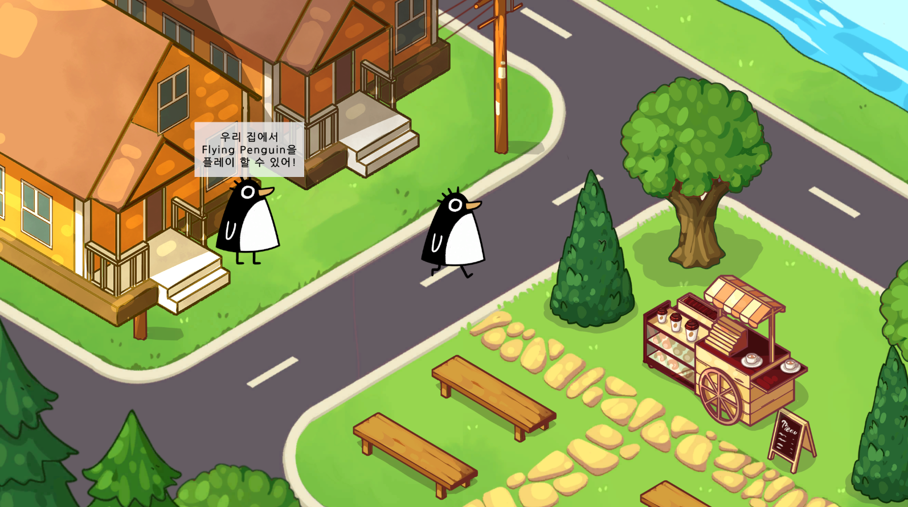

# Penguin Park Readme

$$
\Large{Penguin Park}
$$

---

<aside>

**목차**

</aside>

## 프로젝트 개요

<aside>
💡

Unity를 이용하여 미니 게임을 플레이 할 수 있는 메타버스 공간 **개발 실습 개인 프로젝트.**

펭귄 아바타를 조작하여 야외 카페가 있는 공원 형태의 공간을 돌아다니며 NPC의 집에 방문하여 미니 게임을 플레이 할 수 있음.

</aside>

- 개발 기간: 2025.02.18 ~ 2025.02.20
- 개발 인원: 1인
- 사용 툴
    - Engine : Unity
    - Note, Readme : Notion
    - Flow Chart : Figma
    - VCS : GitHub

## 게임 내 기능

### Main Scene -공원

MainScene 전경

미니 게임 안내 메시지 출력하는 NPC

탑다운 뷰 형식의 메인 공간

- **Player**
    - 방향키 혹은 WASD 키 입력으로 펭귄 아바타를 8방향으로 이동 조작
    - 정지 상태, 이동 상태에 따라 Idle, Move 애니메이션 출력
- **NPC**
    - 3초 출력, 2초 대기를 반복하는 NPC 말풍선
- **Camera**
    - 플레이어의 이동에 따라 카메라가 플레이어를 추적
    - 배경 밖을 비추지 않도록 카메라가 일정 구간을 넘어서 이동하지 않도록 제한
- **Scene 전환**
    - NPC 집 진입 시 미니 게임 Scene 실행

### Mini Game Scene -Flying Penguin

플레이 화면

게임 오버 화면

Flappy Bird 스타일의 사이드 뷰 미니 게임

- **Player**
    - 마우스 클릭으로 펭귄이 점프
    - Die 상태 판단에 따라 Idle, Die 애니메이션 출력
    - 바닥, 천장, 장애물 충돌 시 게임 오버
- **장애물**
    - 고드름 상하단 간의 간격, 높이 랜덤 생성
    - 장애물 간 좌우 거리 일정 간격 생성
    - 장애물 통과 시 상단 UI에 누적 점수 출력
- **Camera**
    - 플레이어의 이동에 따라 카메라가 플레이어를 추적
- **Scene 전환**
    - 게임 오버 시 씬 전환 안내 UI 출력
    - 클릭 시 Main Scene 실행

## 프로젝트 진행 과정

### 스펙 결정

[[page 1] 초기 계획 Flow / [page 2] 실제 개발 Flow](https://embed.figma.com/design/isfz0YU9UXOotQzzhHd0ff/Untitled?node-id=0-1&t=V8H961DegbIecqMQ-1&embed-host=notion&footer=false&theme=system)

[page 1] 초기 계획 Flow / [page 2] 실제 개발 Flow

과제의 필수, 도전 범위 확인 후 To do, Can do 파악을 통해 기간 내 가능한 스펙 결정.

page 1의 Flow과 같은 스펙의 개발을 목표로 프로젝트 시작하였으나, 개발을 진행하며 page 2와 같은 스펙으로 축소.

### 개발 과정

- 함께 실습을 진행하는 조원들과의 소통.
    - TIL 공유 등을 통해 서로 겪은 이슈를 공유하여 발생 가능성이 있는 이슈에 대비
    - 서로 같은 이슈를 겪은 경우 해결 방법 공유.
- 구글 검색, Chat GPT 활용.
    - GPT 활용 시 단순히 How만을 묻는 것이 아닌, What is, Why를 함께 질문한다는 규칙 수립.
    - 규칙 준수를 통해 이해 없는 코드 베껴쓰기를 방지하고, 최대한 학습에 용이한 형태로 활용.

Chat GPT 활용 예시

## 트러블 슈팅

- 첨부 TIL 참고

[2025.02.18 유니티 입문 (4)](https://www.notion.so/2025-02-18-4-1a0098a9668f809daf83ed106ff1908b?pvs=21)

[2025.02.19 유니티 입문 (5)](https://www.notion.so/2025-02-19-5-1a0098a9668f80988796e4e7c7ccd71d?pvs=21)